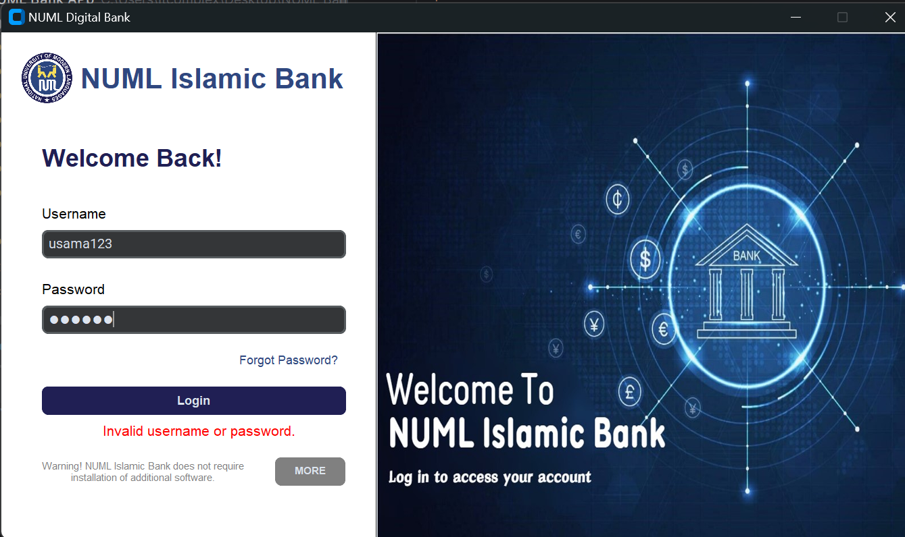
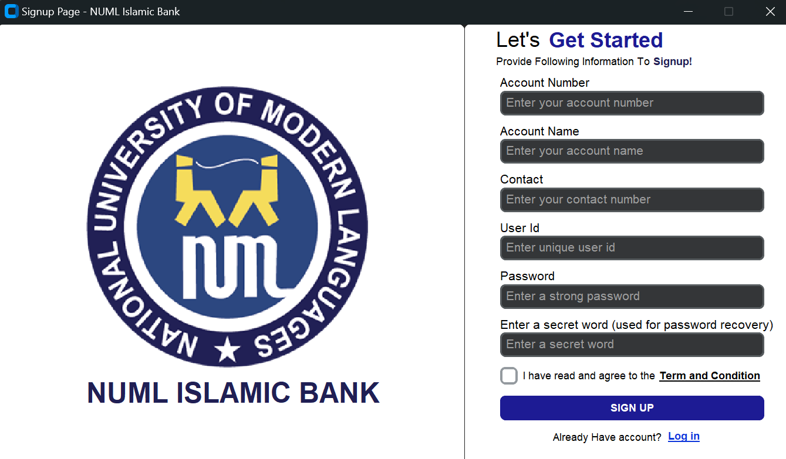
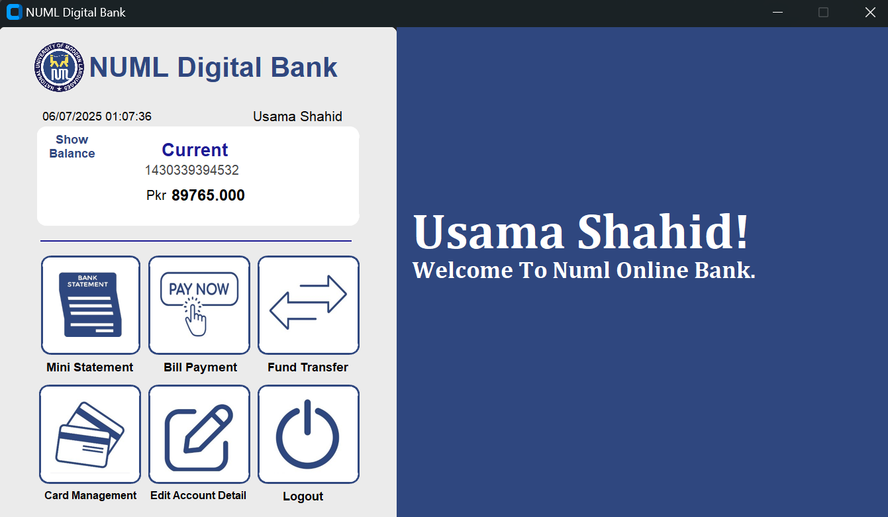
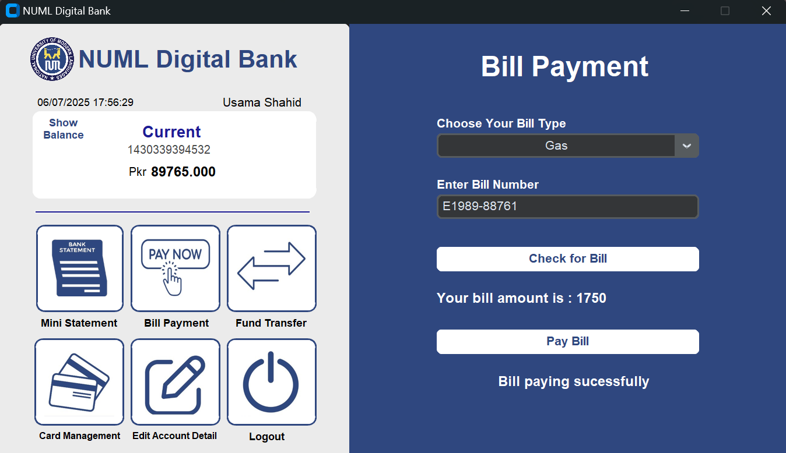

# 🏦 BankApp — Supabase-Based Banking Desktop App

> A secure Python-based banking app that allows users to sign up, log in, manage transactions, change PINs, and view balance — powered by **Supabase** for real-time backend and database functionality.

---

## 📌 Project Summary

BankApp is a lightweight banking management system built in Python that uses Supabase as the backend. It includes essential banking features such as sign-up, login, account balance updates, PIN management, and transaction history tracking. All user data and actions are securely stored and handled via Supabase’s PostgreSQL backend.

---

## ⚙️ Features

* 🔐 **User Signup & Login**
* 💸 **Balance Management**
* 💳 **Card PIN Updates**
* 📜 **Transaction History**
* 🌐 **Supabase Integration**
* ⚡ Built using Python powered logic for rapid prototyping

---

## 🧰️ Tech Stack

| Component    | Tool                  |
| ------------ | --------------------- |
| Language     | Python 3.x            |
| Backend      | Supabase (PostgreSQL) |
| UI Framework | CustomTkinter / CTk   |
| API Handling | `supabase-py`         |

---

## 🗂 Folder Structure

```bash
BankApp/
├── .idea/                   # IDE-specific settings (ignored)
├── Images/                  # UI images like logo, background
├── __pycache__/             # Python cache files
├── Database.py              # Supabase operations (CRUD logic)
├── config.py                # Supabase URL and API key
├── first_page.py            # Account dashboard
├── forgot_password.py       # Forgot password UI logic
├── login_page.py            # Login screen UI
├── main.py                  # Entry point of the app
├── signup_page.py           # Signup screen UI
├── sql_queries.txt          # SQL schema for Supabase setup
├── start.py                 # Starting page to choose login/signup
└── README.md
```

---

## 📝 Supabase Setup Instructions

> 🔔 Before running the app, make sure you have a Supabase account and configure your project as described below.

### 🔧 1. **Create a Supabase Project**

* Go to [https://supabase.com](https://supabase.com)
* Sign in and create a new project

### 📄 2. **Setup Tables**

* Open the file `sql_queries.txt`
* Copy all SQL queries
* Go to **Supabase Dashboard → SQL Editor**
* Paste and run the queries to create tables:

  * `users`
  * `transaction`
  * `card_management`

### 🔑 3. **Set Supabase Config in Code**

* In the `config.py` file, replace with your credentials:

```python
url = "https://your-project.supabase.co"
key = "your-anon-or-service-role-key"
```

---

## 🚀 How to Run

```bash
git clone https://github.com/your-username/BankApp.git
cd BankApp
pip install -r requirements.txt
python main.py
```

---

## 🛡️ Security Notes

* Default balance is set to `10000` for every new user
* PIN is initialized to `0000` by default (can be updated)
* All database operations are handled via Supabase's REST API

---

## 📷 Screenshots

| Login Page                 | Signup Page                 |
| -------------------------- | --------------------------- |
|  |  |

| Main Dashboard                 | Transaction History              |
| ------------------------------ | -------------------------------- |
|  |  |

> These interfaces were designed to demonstrate ease of use and clean UX for users — all powered by the flexibility of Python.

---

## 📩 Contact

👤 **Usama Shaikh**
📧 Email: [shaikhusama541@gmail.com](mailto:shaikhusama541@gmail.com)

Feel free to reach out for:

* 🔓 Code explanation
* 🧪 Data processing pipeline
* 🤝 Collaboration
* 💬 Guidance

---

## 📜 License

This project is for academic and research purposes only. Feel free to fork, reference, and learn — but give credit where due 🙏
